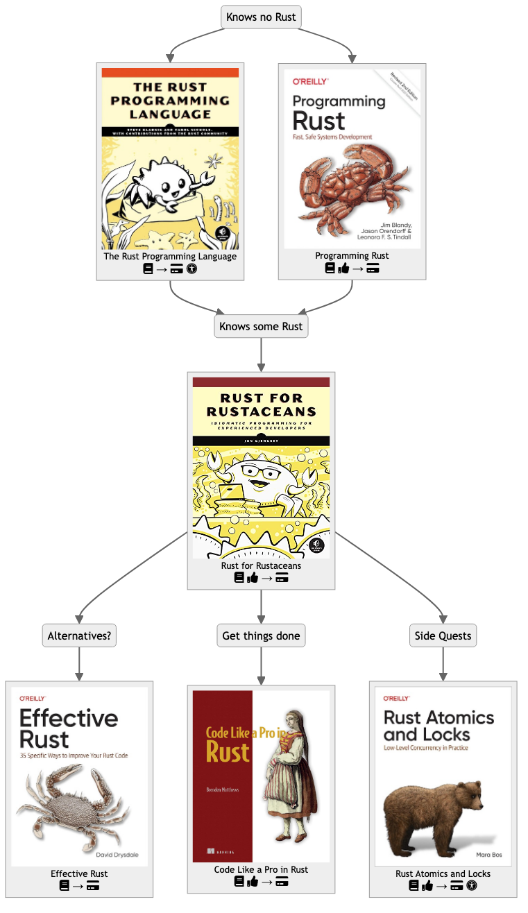

# Learning Rust

> In the crowded landscape of modern programming languages, Rust is different.
> Rust offers the speed of a compiled language, the efficiency of a non-garbage-collected language,
> and the type safety of a functional language — as well as a unique solution to memory safety problems.
> (David Drysdale, "Effective Rust")

## Path planning

[](images/learning-path-1.png)

## Books

### Lists

#### Most Rust Books

Useful as a pool of sources to research, but list is not curated and texts appear to be editorial copies.
Some references are also very old.

https://github.com/sger/RustBooks

### Some I've gathered

#### The Rust Programming Language

https://doc.rust-lang.org/book/

#### Effective Rust

https://www.lurklurk.org/effective-rust/

#### Rust by Example

https://doc.rust-lang.org/rust-by-example/

#### Rust Design Patterns

https://rust-unofficial.github.io/patterns/

#### Data with Rust

https://datawithrust.com/

#### Rust Atomics and Locks

https://marabos.nl/atomics/

(very good)

#### Rust and WebAssembly

https://rustwasm.github.io/docs/book/

#### The Embedded Rust Book

An introductory book about using the Rust Programming Language on "Bare Metal" embedded systems, such as Microcontrollers.

https://docs.rust-embedded.org/book/

## Package finders

#### Blessed.rs

https://blessed.rs/crates

> An unofficial guide to the Rust ecosystem.

Helps you find crates to complement the minimal approach Rust has to the "batteries included" philosophy.

<!-- Good place to start as it appears to contain a smaller selection of more established crates. -->

#### Lib.rs

https://lib.rs/

> Index of Rust libraries and applications. Lightweight, opinionated, curated, unofficial alternative to crates.io.

With own sorting algorithm, and a search function.

## Blogs, Portals

#### This week in Bevy

(Bevy is a game engine also useful for visualizations.)

With blog and nice youtube channel:

https://thisweekinbevy.com/

## Probably useful crates

### Derive More

https://github.com/JelteF/derive_more

Avoid boilerplate code. It does this by allowing you to derive lots of commonly used traits for both structs and enums.

### Rayon (data-parallelism library)

https://github.com/rayon-rs/rayon

## Corners and Concepts

### Unicode

[Intro to unicode and character sets](https://www.joelonsoftware.com/2003/10/08/the-absolute-minimum-every-software-developer-absolutely-positively-must-know-about-unicode-and-character-sets-no-excuses/)

### Types and Ownership

#### Opaque types

A very human explanation:

https://stackoverflow.com/questions/64693182/rust-expected-type-found-opaque-type

Interesting:

https://www.reddit.com/r/rust/comments/11kyls1/just_realize_opaques_types_have_real_compiletime/

And then this:

https://rustc-dev-guide.rust-lang.org/opaque-types-type-alias-impl-trait.html

#### Copy trait

Transforms a value from "move semantics" onto "copy semantics".

https://doc.rust-lang.org/std/marker/trait.Copy.html

> Types whose values can be duplicated simply by copying bits.

```
struct Foo;
let x = Foo;
let y = x;
// x is now unusable
```

However:

```
#[derive(Copy, Clone)]
struct Foo;
let x = Foo;
let y = x;
// x can still be used
```

Note that `Clone` is necessary, as it is a "[supertrait](https://doc.rust-lang.org/rust-by-example/trait/supertraits.html)" of `Copy`.

#### Chalk

The repo:
https://github.com/rust-lang/chalk?tab=readme-ov-file

The Book:
https://rust-lang.github.io/chalk/book/what_is_chalk.html

### Concurrent / Async / Network

#### Tokio

> Tokio is an asynchronous runtime for the Rust programming language. It provides the building blocks needed for writing network applications.

https://tokio.rs/

#### Smol

> A small and fast async runtime.

> A lightweight runtime, intended to compete with Tokio

Check the examples folder for some cool scripts and ideas. Good for exploring other crates too.

https://github.com/smol-rs/smol

#### Crossbeam crate

https://github.com/crossbeam-rs/crossbeam

### Functional programming

#### Batteries-included `iter` module

https://doc.rust-lang.org/std/iter/index.html

#### Complementary crate `itertools`

https://docs.rs/itertools/latest/itertools/

#### Scoped Threads

https://doc.rust-lang.org/std/thread/fn.scope.html

#### Futures

https://doc.rust-lang.org/std/future/trait.Future.html

#### Generic Associated Types

[ Rust Blog - Generic associated types to be stable in Rust 1.65 ](https://blog.rust-lang.org/2022/10/28/gats-stabilization.html)

#### Rust libcore

https://doc.rust-lang.org/core/

## Articles

#### Learning Parser Combinators With Rust

https://bodil.lol/parser-combinators/

#### Experiments with Structured Concurrency in Rust

https://github.com/nikomatsakis/moro

## Forums and chats

#### Rust Lang chat

https://rust-lang.zulipchat.com/

## Other doc pointers

https://github.com/nikomatsakis/how-to-rust

## UI

### TUI

#### Ratatui

https://ratatui.rs/

### GUI

Pointers for building GUIs with Rust:

https://areweguiyet.com/

Pointers for building games with Rust:

https://arewegameyet.rs/

#### Floem

> A native Rust UI library with fine-grained reactivity

Made by/for Lapce editor team. Cross-platform. The Lapce UI is a git awkward, especially in terms of detailed UI components, not sure bow much that depends on this library.

https://github.com/lapce/floem

#### Iced

https://github.com/iced-rs/iced

The documentation:

https://book.iced.rs/

#### RUI

https://github.com/audulus/rui

Experimental but consider me curious.

#### Slint

https://github.com/slint-ui/slint

#### Flutter

Flutter-Rust Bridge:
https://github.com/fzyzcjy/flutter_rust_bridge/

#### Tauri

Create apps using an embedded web view, similar in principle to Electron.
However, you can implement your business logic in Rust using "Commands, essentially Rust functions that you can call from your frontend JavaScript"!
A lot of stars on Github. Looks promising!

https://tauri.app/

https://github.com/tauri-apps/tauri

[Tauri vs Flutter](https://www.reddit.com/r/rust/comments/14g95hn/tauri_vs_flutter/)

[ Tauri Inter-Process Communication guide ] ( https://tauri.app/v1/references/architecture/inter-process-communication/ )

#### Winit

Cross-platform window creation and management in Rust

https://crates.io/crates/winit

Note: could be a good candidate for experimenting with my "mouseless mouse actions" idea. Also check Tao below.

Also check [Global Hotkey](https://github.com/tauri-apps/global-hotkey).

#### Tao (part of Tauri, fork of Winit)

> Cross-platform application window creation library in Rust that supports all major platforms like Windows, macOS, Linux, iOS and Android. Built for you, maintained for Tauri.

Looks like a very minimal, easy way to make a GUI window(s).

https://github.com/tauri-apps/tao

Check the examples in the WRY crate, also by the Tauri team:

https://github.com/tauri-apps/wry

#### Realm4

> Relm4 is an idiomatic GUI library inspired by Elm and based on gtk4-rs.

https://relm4.org/book/stable/

Not very impressed by the examples but remain open-minded.

## Machine Learning

#### Are we learning yet?

> A work-in-progress to catalog the state of machine learning in Rust

https://www.arewelearningyet.com/

## Parsers

### HTML

#### Scraper

https://github.com/causal-agent/scraper

### Generic

#### Nom

https://github.com/rust-bakery/nom

#### Combine

https://github.com/Marwes/combine

(inspired by Haskell's Parsec)

#### Pom

https://github.com/J-F-Liu/pom

## Rust Projects to Follow

#### Helix Editor

Awesome TUI-only editor that could hopefully one day replace NVim. Would love to contribute.

https://github.com/helix-editor/helix

#### Zed Editor

> a high-performance, multiplayer code editor from the creators of Atom and Tree-sitter.

VSCode clone with very smooth UX. Interesting collab features that have not tried yet. AI support, never tried. Does not appear to be very configurable/extensible.
Has minimal Vim mode.

https://github.com/zed-industries/zed

#### Lapce

Cross-platform code editor similar to Zed/VSCode, using interesting Rust deps, UI/UX less smooth than Zed or Helix.
Has (very) minimal Vim mode.

https://lapce.dev/

#### Neovide

GUI wrapper for Neovim. Use it every day. Love the UX of the animated cursor, smooth scrolling, full modifier keys configurability.
That said, it is rough around the edges: terrible Mac OS integration (as of 2024) and freezes often.

https://github.com/neovide/neovide

#### Siffnet

Monitor your Internet traffic. Gui implemented in Iced.

https://github.com/GyulyVGC/sniffnet
