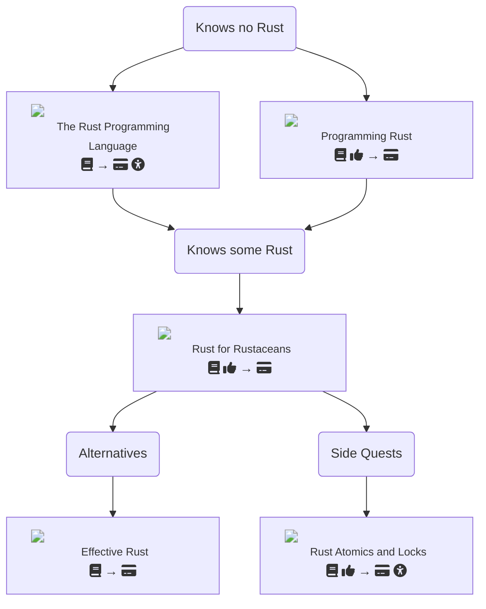

# Learning paths

```mermaid
flowchart TD
A(Knows no Rust)

A --> TheRPL[
<img src='https://raw.githubusercontent.com/ikimmit/learning-rust/master/images/StarchRustProgrammingLang.jpeg' /> <small>The Rust Programming Language</small>
<div style='width: 200px'>fa:fa-book &rarr; fa:fa-credit-card fa:fa-universal-access</div>]

click TheRPL "https://doc.rust-lang.org/book/" "Go to link"

A --> OreillyPR[<img src="https://raw.githubusercontent.com/ikimmit/learning-rust/master/images/OreillyProgrammingRust.jpeg" /><small>Programming Rust</small>
<div style='width: 200px'>fa:fa-book fa:fa-thumbs-up &rarr; fa:fa-credit-card</div>]
click OreillyPR "https://www.oreilly.com/library/view/programming-rust-2nd/9781492052586/" "Go to link"

TheRPL --> B(Knows some Rust)
OreillyPR --> B

B --> Rustaceans[
<img src='https://raw.githubusercontent.com/ikimmit/learning-rust/master/images/StarchRustForRustaceans.jpeg' /> <small>Rust for Rustaceans</small>
<div style='width: 200px'>fa:fa-book fa:fa-thumbs-up &rarr; fa:fa-credit-card</div>]
click Rustaceans "https://nostarch.com/rust-rustaceans" "Open"

Rustaceans --> C(Alternatives)

C --> EffectiveRust[
<img src="https://raw.githubusercontent.com/ikimmit/learning-rust/master/images/OreillyEffectiveRust.jpeg" /> <small>Effective Rust</small>
<div style='width: 200px'>fa:fa-book &rarr; fa:fa-credit-card</div>]
click EffectiveRust "https://www.oreilly.com/library/view/effective-rust/9781098151393/" "Open"

Rustaceans --> D(Side Quests)

D --> RustAtomics[
<img src="https://raw.githubusercontent.com/ikimmit/learning-rust/master/images/OreillyRustAtomics.jpeg" /> <small>Rust Atomics and Locks</small>
<div style='width: 200px'>fa:fa-book fa:fa-thumbs-up &rarr; fa:fa-credit-card fa:fa-universal-access</div>]
click RustAtomics "https://marabos.nl/atomics/" "Open"

classDef book witdh:200px
```
<link
  href="https://cdnjs.cloudflare.com/ajax/libs/font-awesome/6.5.2/css/all.min.css"
  rel="stylesheet"
/>
